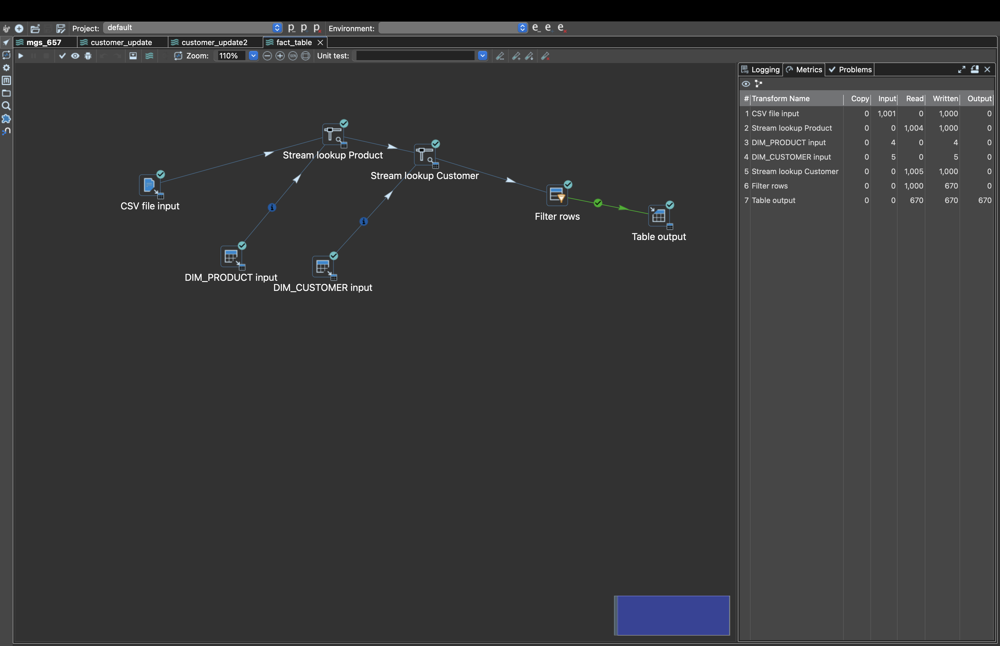
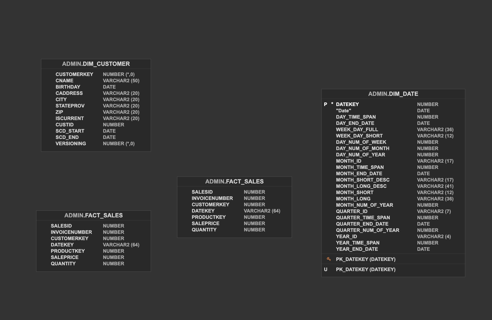
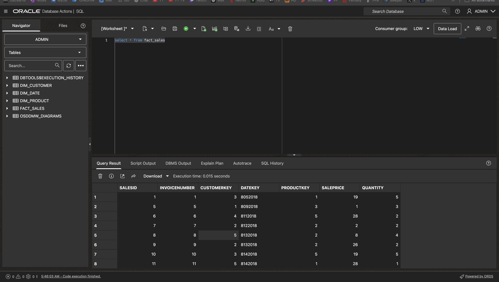

# Cloud Data Warehousing & ETL Pipeline  
**Oracle ADW | Apache Hop | SQL | Tableau**

Built a production-style ETL pipeline and star schema data warehouse from scratch using cloud and modern data tools.

---

## 📊 Pipeline Overview

---

## Overview
Designed and implemented an end-to-end ETL pipeline to transform raw sales data into a structured star schema using Oracle Autonomous Data Warehouse and Apache Hop. The project focuses on data modeling, pipeline development, and preparing data for analytics.

---

## 🧱 Data Model

- Fact Table: `FACT_SALES`  
- Dimensions: `DIM_CUSTOMER`, `DIM_PRODUCT`, `DIM_DATE`  

---

## ⚙️ Tech Stack
- Oracle Autonomous Data Warehouse  
- Apache Hop  
- SQL  
- Tableau  

---

## 🔄 ETL Process
- Ingested data from CSV files  
- Performed stream lookups for customer and product dimensions  
- Loaded transformed data into the fact table  
- Used pre-aligned date keys (no lookup required)

---

## 📈 Sample Output

---

## 📁 Files
- SQL scripts (`/sql`)  
- ETL pipeline visuals (`/images`)  
- Full project report  

---

## 👤 Author
Zachary Snow  
M.S. Management Information Systems – University at Buffalo
